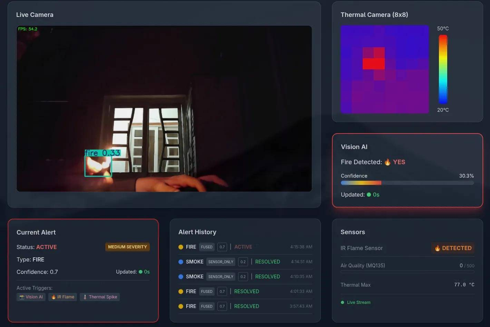

# Talos Sentinel: Multi-Modal Autonomous Surveillance via Sensor Fusion & Computer Vision
This project was developed as a Final Year Project (FYP) for the completion of a **Bachelor's Degree in Computer Science** at **Shah Abdul Latif University, Khairpur**.

**Talos Sentinel** transitions traditional surveillance from passive recording to active hazard response by deploying a locally optimized **YOLOv8** model on a **Raspberry Pi 5** . To eliminate the high false-positive rates typical of vision-only systems, this visual intelligence is mathematically fused with a hardware sensor array—including an **AMG8833 thermal camera**, **MQ-135 gas sensor**, and **Flame IR sensor**—to detect fire, smoke, and gas leaks in real-time.

Built with a "Privacy-First" philosophy, the entire architecture operates at the **Edge**, ensuring zero reliance on third-party cloud infrastructure or external internet connectivity.

## Features:
### 1. Core Intelligence & Processing
* **Edge-Based AI Inference:** Utilizes a custom-trained YOLOv8 model optimized via the **NCNN framework** to detect fire and smoke locally on a Raspberry Pi 5 without cloud dependency.
* **Mathematical Fusion Engine:** A decoupled background loop that calculates a normalized **Risk Score** by cross-referencing AI vision data with physical sensor telemetry to reduce false positives.
* **Thermal Rate of Rise (RoR) Calculation:** Monitors how fast temperature spikes per second rather than waiting for an absolute heat threshold, allowing for faster ```Flash Fire``` detection.
* **State-Driven Alert Lifecycle Manager:** Transitions threats through strict **NEW**, **ACTIVE**, and **RESOLVED** phases using ```persistence windowing``` to verify hazards over time.
    <div align="center">
    
    </div>

### 2. Hardware & Connectivity
* **Multi-Modal Sensor Array:** Integrates an **AMG8833** thermal camera, **MQ-135** gas/smoke sensor, and **Flame IR** sensor for secondary hardware validation of visual threats.
* **Hardwired Serial USB Bridge:** Connects the ESP32 sensor manager to the Raspberry Pi 5 via USB to eliminate wireless latency or interference during an emergency.
* **Standalone Wireless Access Point (WAP):** The system broadcasts its own encrypted ad-hoc network, ensuring it remains operational and accessible even if municipal internet infrastructure fails.
    <div align="center">
    
    </div>

### 3. Software & Security
* **Asynchronous Vision Pipeline:** Employs Python's multiprocessing and shared memory to isolate heavy AI math from the web server, maintaining a fluid 25 to 30 FPS camera feed.
* **Token-Based Authentication (JWT):** Secures all REST APIs, evidence snapshots, and live video streams using **JSON Web Tokens** and **bcrypt** password hashing.
    <div align="center">
    
    </div>
* **Dual SQLite Database Architecture:** Uses separate, lightweight databases for secure user authentication (**auth.db**) and persistent, high-efficiency event logging (**alerts.db**).
    <div align="center">
    
    </div>
* **Containerized Microservices:** The entire software stack is deployed via **Docker**, ensuring environment isolation and easy portability across different hardware.

### 4. User Interface & Monitoring
* **Real-Time React Web Dashboard:** A high-contrast dark-mode interface featuring dynamic thermal grid color-mapping, live MJPEG streaming, and interactive alert history.
    <div align="center">
    
    </div>
* **Hybrid Android Mobile Application:** A Capacitor-powered application that provides mobile monitoring, remote push notifications, and evidence retrieval over the local network.
* **Low-Latency Evidence Capture:** Automatically captures high-fidelity visual snapshots with bounding box overlays the moment an alert becomes ```ACTIVE``` for later audit.
* **Client-Side CSV Export:** Allows administrators to generate and download structured incident reports directly from the browser for record-keeping.

## Installation & Deployment Guide:
This guide details the steps required to set up this system on a Raspberry Pi 5 and ESP32.

### 1. Prerequisites
Before starting, ensure you have the following installed on your development machine:
* Python 3.12+
* Node.js (v24 or newer)
* Arduino IDE (for ESP32 flashing)
* Docker & Docker Compose (optional, for containerized deployment)

### 2. Hardware Setup
1. **Sensor Array:** Wire the AMG8833, MQ-135, and Flame IR sensors to the ESP32 according to the Pinout Mapping & Calibration Guide in ```./repo_resources/sensor_calibration_and_mapout.md```.
2. **Connection:** Connect the ESP32 and USB Camera to the Raspberry Pi 5 via USB ports .
3. **Networking:** Power on the Pi. It is configured to broadcast an ad-hoc network: ```AI_Surveillance_Edge```.

### 3. Microcontroller Firmware
1. Open ```sensors/AMG_MQ_IR/AMG_MQ_IR.ino``` in the **Arduino IDE**.
2. Install libraries: ```Adafruit_AMG88xx``` and ```Wire```.
3. Select your ESP32 board and click **Upload**.

### 4. Backend & AI Engine Setup
```
# Clone the repository
git clone https://github.com/umairyousif239/AI-Surveillance-System.git
cd AI-Surveillance-System

# Create and activate virtual environment
python -m venv venv
source venv/bin/activate

# Install dependencies (FastAPI, OpenCV, NCNN)
pip install -r requirements.txt

# Start the API server
uvicorn backend.app:app --host 0.0.0.0 --port 8000
```

### 5. Frontend Dashboard Setup
In a new terminal on the Pi (It is possible to run the frontend alongside the backend. However, it is highly recommended to host it on a different machine to mitigate the processing on the Pi 5): 
```
cd fire-dashboard
npm install

# Set the target IP to the Pi's Access Point IP
echo "VITE_IP_ADDR=10.42.0.1" > .env

# Run in development mode
npm run dev
```

### Docker Deployment (Alternative)
```
# Ensure you are in the root directory
docker-compose up --build -d
```
Note: Docker automatically handles hardware passthrough for ```/dev/video0``` and the ESP32 serial bridge.

### Mobile App (Android)
1. Sync the web assets: ```npx cap sync android```.
2. Open the ```android``` folder in **Android Studio**.
3. Connect your phone (with USB Debugging enabled) and click **Run** to flash the APK .

## To-do List:
- [x] Collect Datasets.
- [x] Train the model using the collected dataset.
- [x] Combine the sensors to send data properly as a CSV.
- [x] Turn that CSV into a JSON format and then Stream it as an API.
- [x] Stream the camera input through an API.
- [x] Add in alerts API.
- [x] Combine the camera and sensor data as a proper backend.
- [x] Add in a proper database for alerts and data storage.
- [x] Create a front end to show all the sensor data and camera input in a single clean dashboard.
- [x] Have the frontend show visuals from the camera and the thermal sensor.
- [x] Fix the vision detection issue where the detections don't appear on the frontend.
- [x] Fix the where the history doesn't appear on the frontend.
- [x] Add Authentication to the project
- [x] Dockerize the whole project.
- [x] Optimize and host the project onto a Raspberry pi 5.

## License
This project is licensed under the **GNU General Public License v3.0**. 

**Note for users:** This project was developed as a Bachelor's Thesis at **Shah Abdul Latif University**. While you are encouraged to use and modify the code for educational and open-source purposes, any derivative works must remain open-source under the same license. Commercial use is restricted by the underlying YOLOv8 licensing terms.

## Disclaimer
This system is a **university prototype** developed for research and educational purposes as part of a Bachelor's Thesis. While it demonstrates high accuracy in controlled environments, it is **not** a certified industrial safety device or a replacement for professional fire alarms and life-safety systems. Use of this software in real-world critical safety scenarios is at the user's own risk.

## How to Cite
If you use this project, its underlying logic, or the research methodology in your own work, please cite it as follows:

### APA Style:
    Bhatti, U. Y. (2026). Autonomous Edge Surveillance: Multi-Modal Hazard Detection via Computer Vision and Sensor Fusion (Bachelor's Thesis). Shah Abdul Latif University, Khairpur (Shahdadkot Campus).

### BibTeX:
```
@thesis{bhatti2026talossentinel,
  author  = {Bhatti, Umair Yousif},
  title   = {Autonomous Edge Surveillance: Multi-Modal Hazard Detection via Computer Vision and Sensor Fusion},
  school  = {Shah Abdul Latif University, Khairpur},
  year    = {2026},
  address = {Shahdadkot Campus},
  type    = {Bachelor's Thesis},
  note    = {Department of Computer Science}
}
```

## Directory Structure:
```
├── .devcontainer
│   └── devcontainer.json
├── ai_module
├── backend
│   ├── api
│   │   ├── alerts.py
│   │   ├── login.py
│   │   ├── sensors.py
│   │   └── vision.py
│   ├── bridge
│   │   └── serial_bridge.py
│   ├── database
│   ├── modules
│   │   ├── alert_config.py
│   │   ├── alert_loop.py
│   │   ├── alert_state.py
│   │   ├── alert_store.py
│   │   ├── alerts_engine.py
│   │   └── auth_store.py
│   ├── app.py
│   └── dummy_data.py
├── fire-dashboard
│   ├── android
│   │   ├── app
│   │   ├── gradle
│   ├── public
│   ├── src
│   │   ├── assets
│   │   ├── App.css
│   │   ├── App.jsx
│   │   ├── index.css
│   │   └── main.jsx
│   ├── .gitignore
│   ├── README.md
│   ├── capacitor.config.json
│   ├── eslint.config.js
│   ├── index.html
│   ├── package-lock.json
│   ├── package.json
│   ├── postcss.config.js
│   ├── tailwind.config.js
│   └── vite.config.js
├── models
│   ├── trained_yolov8n_ncnn_model
│   ├── yolov8n_ncnn_model
│   │   ├── metadata.yaml
│   │   ├── model.ncnn.bin
│   │   ├── model.ncnn.param
│   │   └── model_ncnn.py
│   └── yolov8n.pt
├── repo_resources
│   ├── images
│   │   ├── alert_state_diagram.png
│   │   ├── database_schema.png
│   │   ├── system_architecture_diagram.png
│   │   ├── uml_sequence_diagram.png
│   │   └── user_interface.jpg
│   └── sensor_calibration_and_mapout.md
├── sensors
│   ├── AMG_MQ_IR
│   │   └── AMG_MQ_IR.ino
│   └── Sensor Fusion Wiring.txt
├── .gitignore
├── LICENSE
├── README.md
├── main.py
└── requirements.txt
```